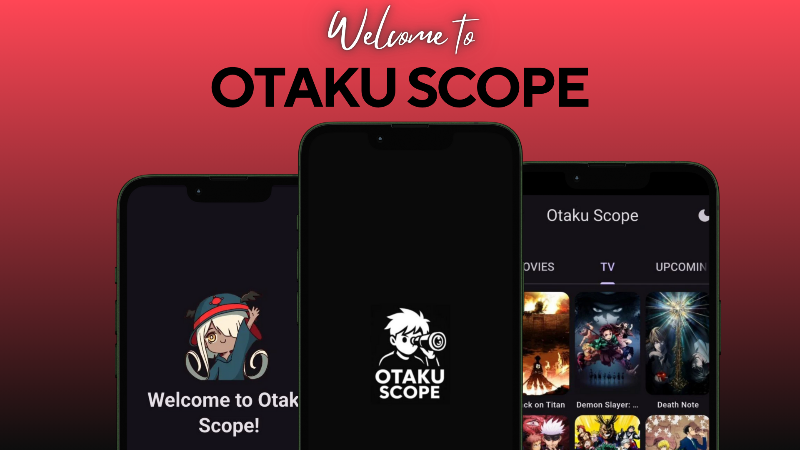

# Otaku Scope 📱

A modern Flutter application for anime and manga enthusiasts to discover, explore, and track their favorite content. Built with clean architecture, robust state management, and beautiful UI/UX.

## ✨ Features

### 🎌 Anime & Manga Discovery
- **Seasonal Anime**: Browse current season's trending anime with seasonal categorization
- **Top Anime**: Explore top-rated anime across different categories (TV, Movies, Upcoming)
- **Top Manga**: Discover popular manga and light novels
- **Latest Updates**: Stay updated with recently released episodes and chapters
- **Recommendations**: Get personalized anime recommendations based on your interests

### 🔍 Search & Navigation
- **Smart Search**: Find anime and manga with intelligent search functionality
- **Detailed Views**: Comprehensive media details with character information, episodes, and chapters
- **Smooth Navigation**: Intuitive navigation with custom transitions and animations

### 🎨 User Experience
- **Dark/Light Theme**: Toggle between themes with persistent preferences
- **Onboarding**: Beautiful animated onboarding experience for new users
- **Responsive Design**: Optimized for various screen sizes and orientations
- **Loading States**: Elegant loading skeletons and error handling

## 🏗️ Architecture

### Clean Architecture
- **Presentation Layer**: Flutter widgets with Riverpod state management
- **Business Logic**: StateNotifier controllers for feature-specific logic
- **Data Layer**: Repository pattern with GraphQL API integration
- **Core**: Shared utilities, models, and services

### Tech Stack
- **Framework**: Flutter 3.8+
- **State Management**: Riverpod with StateNotifier
- **Navigation**: GoRouter with shell routing
- **Networking**: Dio with Retrofit for GraphQL
- **Data Models**: Freezed with JSON serialization
- **UI Components**: Material Design with custom theming
- **Animations**: Lottie for onboarding animations

### Key Dependencies
```yaml
dependencies:
  flutter_riverpod: ^3.0.0-dev.17    # State management
  go_router: ^16.0.0                 # Navigation
  dio: ^5.8.0+1                      # HTTP client
  retrofit: ^4.7.0                   # API client generation
  freezed_annotation: ^3.1.0         # Data classes
  lottie: ^3.3.2                     # Animations
  cached_network_image: ^3.4.1       # Image caching
  shimmer: ^3.0.0                    # Loading effects
```

## 🚀 Getting Started

### Prerequisites
- Flutter SDK 3.8.0 or higher
- Dart SDK 3.0.0 or higher
- Android Studio / VS Code with Flutter extensions

### Installation

1. **Clone the repository**
   ```bash
   git clone https://github.com/karimMohammed912-gif/Otaku-Scoop.git
   cd otaku_scope
   ```

2. **Install dependencies**
   ```bash
   flutter pub get
   ```

3. **Generate code**
   ```bash
   flutter packages pub run build_runner build
   ```

4. **Run the app**
   ```bash
   flutter run
   ```

## 📱 App Mockups

Here are the design mockups showcasing the key features and user interface of Otaku Scope:

### Welcome & Onboarding Experience
<div align="center">
  
  <p><em>Welcome to Otaku Scope - Beautiful onboarding experience with animated characters and splash screen</em></p>
</div>

### App Introduction & Features
<div align="center">
  
  <p><em>App Introduction - Discover the full anime universe with detailed character profiles and personalized recommendations</em></p>
</div>

### Core Features: Search, Watch & Read
<div align="center">
  
  <p><em>Core Features - Search anime/manga, watch episodes, and read chapters with comprehensive details</em></p>
</div>

### Anime & Manga World Navigation
<div align="center">
  
  <p><em>Enter the Anime & Manga World - Seasonal browsing, categories, and comprehensive content discovery</em></p>
</div>

### The Description
<div align="center">
  
  <p><em>The Description of the app  </em></p>
</div>
  
  ## Pdf Link For the Mockups
  [Mockups](https://drive.google.com/file/d/10KgH2JQS3U5J5r5LTrpm--PW6d2puPQL/view?usp=drive_link)

## 🛠️ Development

### Project Structure
```
lib/
├── core/                    # Shared utilities and services
│   ├── errors/             # Error handling and failure types
│   ├── graphQL/            # GraphQL service and queries
│   ├── models/             # Core data models
│   ├── providers/          # Global providers
│   ├── repo/               # Base repository
│   ├── router/             # App routing configuration
│   ├── services/           # Shared services
│   ├── utils/              # Utility classes and enums
│   └── widgets/            # Reusable UI components
├── features/               # Feature-based modules
│   ├── details_feature/    # Media details (anime/manga)
│   ├── last_update_anime/  # Latest anime updates
│   ├── last_update_manga/  # Latest manga updates
│   ├── onboardingFeature/  # User onboarding
│   ├── recommendation_anime/ # Anime recommendations
│   ├── search/             # Search functionality
│   ├── seasonal_anime/     # Seasonal anime browsing
│   ├── top_anime/          # Top anime listings
│   └── top_manga/          # Top manga listings
└── main.dart               # App entry point
```

### Code Generation
The project uses code generation for models and providers. Run the following command after making changes to annotated classes:

```bash
flutter packages pub run build_runner build --delete-conflicting-outputs
```

### API Integration
- **Data Source**: AniList GraphQL API
- **Authentication**: Public API (no authentication required)
- **Rate Limiting**: Built-in retry logic with exponential backoff
- **Error Handling**: Comprehensive error mapping and user-friendly messages

## 🎯 Features in Detail

### State Management
- **Riverpod**: Modern state management with compile-time safety
- **StateNotifier**: Business logic encapsulation
- **Provider Pattern**: Dependency injection and service location

### Navigation
- **GoRouter**: Declarative routing with type-safe navigation
- **Shell Routes**: Consistent app shell with drawer navigation
- **Custom Transitions**: Smooth page transitions for better UX

### Data Flow
- **Repository Pattern**: Clean separation of data sources
- **GraphQL**: Efficient data fetching with precise queries
- **Caching**: Image caching and smart data management
- **Pagination**: Infinite scroll with loading states

## 🤝 Contributing

1. Fork the repository
2. Create a feature branch (`git checkout -b feature/amazing-feature`)
3. Commit your changes (`git commit -m 'Add some amazing feature'`)
4. Push to the branch (`git push origin feature/amazing-feature`)
5. Open a Pull Request

## 📄 License

This project is licensed under the MIT License - see the [LICENSE](LICENSE) file for details.

## 🙏 Acknowledgments

- [AniList](https://anilist.co/) for providing the comprehensive anime and manga API
- [Flutter](https://flutter.dev/) team for the amazing framework
- [Riverpod](https://riverpod.dev/) for excellent state management
- The open-source community for various packages and inspiration

---

**Made with ❤️ for anime and manga lovers**
